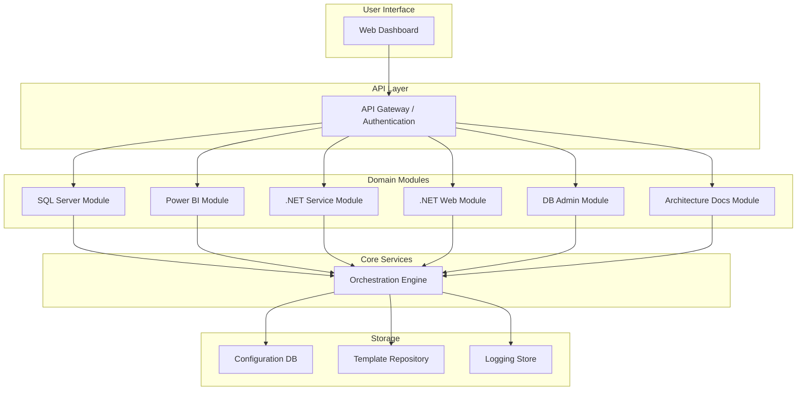

# Auto-Jeremy Architecture Diagram

This diagram illustrates the high-level architecture of the Auto-Jeremy system, showing the relationships between the different components:

1. **User Interface**: The web dashboard that users interact with
2. **API Layer**: Handles authentication and routes requests to appropriate modules
3. **Domain Modules**: Specialized modules for each technical domain
4. **Core Services**: The orchestration engine that coordinates tasks
5. **Storage**: Various storage services for configuration, templates, and logs